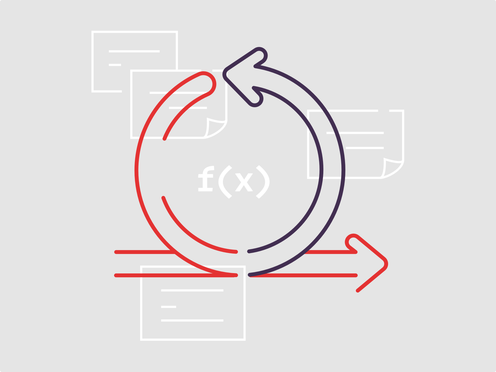
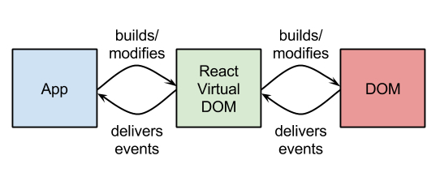
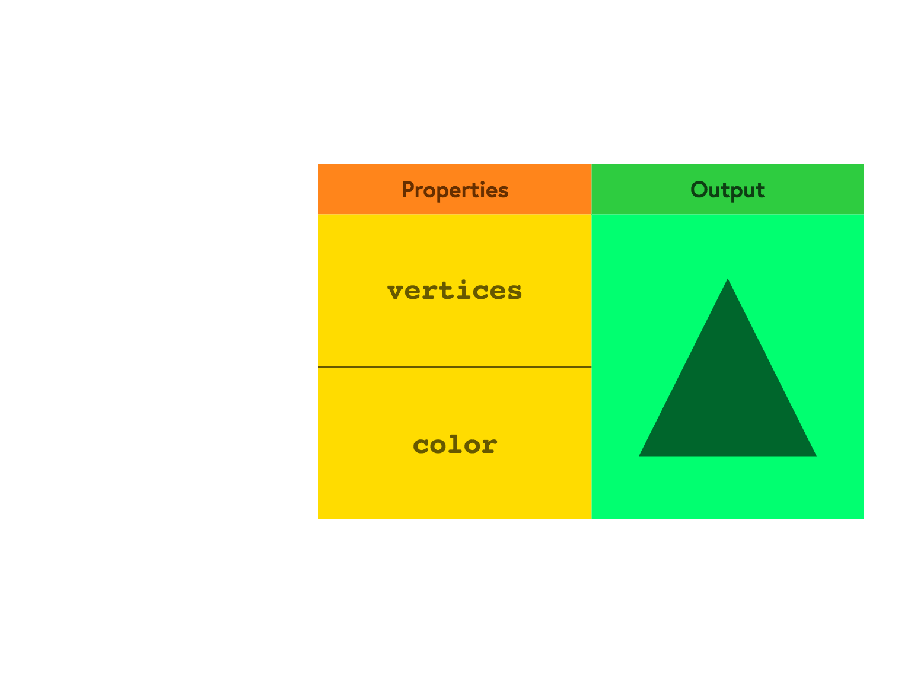
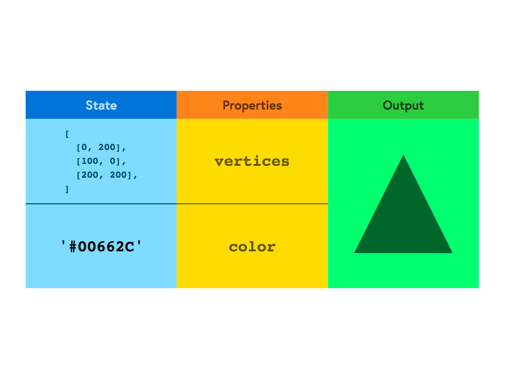
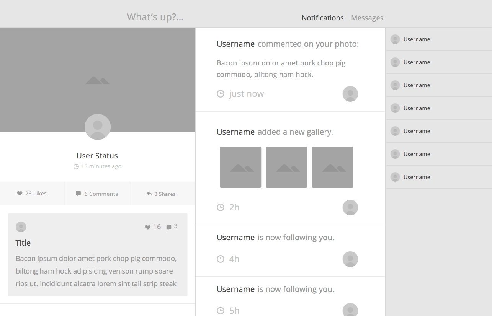

# [fit] Rangle.io
# [fit] React Training

---

## Prerequisites

- Access to the command line
- Node.js (v6 or higher)
- NPM (v3 or higher)
- Code editor (Sublime, Atom, etc.)
- Some JavaScript knowledge (ES5/ES6)

---

## Overview

- ES6
- Light functional JavaScript
- From jQuery to React
- Thinking in Components
- create-react-app
- Components
	- JSX
	- State & Props
	- Stateless components
	- Stateful components
	- Lifecycle methods
	- PropTypes
	- DOM mounting
- REST API (fetch)

---

# [fit] 🤷🏽‍♂️ Ecmascript 2015

---

# [fit] [🙋🏾‍♂️ Ecmascript 2015 Examples](https://codepen.io/winkerVSbecks/pres/YVYooe?editors=0012)

---

## [fit] Functional Programming
## [fit] with JavaScript


---

## Pure Functions

A function where the return value is only determined by
- its input values
- without observable side effects

```js
const add = (a, b) => a + b;
```

---

## Pure Functions (Slice vs. Splice)

```js
let letters = ["a", "b", "c"]

letters.slice(1)
// returns ["b", "c"], where letters is still ["a", "b", "c"]

letters.splice(1)
// returns ["b", "c"], where letters is now ["a"]
```

---

## Map, Filter & Reduce

Array helper methods `map`, `filter` and `reduce` are examples of functional programming, which take in functions and do not mutate the original array.

[🙋🏾‍♂️ examples](https://codepen.io/winkerVSbecks/pres/eWywaJ?editors=0012)

---

## Currying

A technique of converting a function that takes multiple arguments into a sequence of functions, each with a single argument.

```js


f (a, b, c) ↔️ f(a)(b)(c)
```

---

## Currying `add`

```js
function add (a, b) {
  return a + b;
}

add(1, 2); // returns 3

// Curryed add()
function add (a) {
  return function(b) {
    return a + b ;
  }
}
```

---

## Currying `add`

```js
// returns a function where a = 2
const add2 = add(2);

// returns 5
add2(3);
```

---

## Currying `add` With ES6

```js
const add = a => b => a + b;
```

[🙋🏾‍♂️ example](https://codepen.io/winkerVSbecks/pres/aWEgeJ)

---

# [fit] React

---

## Journey to React

- Direct DOM manipulation/jQuery
- Templates
- Template based frameworks such as AngularJS

---

## jQuery

```html
<article class="card">
  

  <h1 class="card-title">Leanne Graham</h1>

  <a class="card-link"
    href="mailto:sincere@april.biz">
    sincere@april.biz
  </a>
</article>
```

```js
// handle events
$('.card').click(function() { /* do something */ });
```

---

## Templates

```html
<article class="card">
  

  <h1 class="card-title">{{ robot.name }}</h1>

  <a class="card-link"
    href="mailto:{{ robot.email }}">
    {{ robot.email }}
  </a>
</article>
```

```js
// handle events
$('.card').click(function() { /* do something */ });
```

---

## AngularJS

```html
<article class="card" ng-click="doSomething(robot)">
  

  <h1 class="card-title">{{ robot.name }}</h1>

  <a class="card-link"
    href="mailto:{{ robot.email }}">
    {{ robot.email }}
  </a>
</article>
```

```js
// update data
robot.name = 'Ervin Howell';
```

---

## First Gen. SPA Frameworks
- Renders the DOM using templates
- Manages DOM updates when data changes
- Manages event bindings (`click`, `scroll`, etc.)

---

# [fit] How Is React Different?

---

## [fit] views as pure
## [fit] stateless functions

---

## [fit] `View(Data)` ➡️ `HTML`

---

## React

- No templates
- Define UI as components
  - connected to data
- Re-renders the whole world when data changes
- Manages event bindings

---

## Hello, world! [^0]

```js
// in app.js
ReactDOM.render(
  <h1 className="title">Hello, world!</h1>,
  document.getElementById('root')
);
```

```html
<!-- in index.html -->
<div id="root"></div>
```

[^0]: [🙋🏾‍♂️ full example](http://codepen.io/winkerVSbecks/pres/ZKvNyR)

---

## [fit] JSX

---

# JSX 🤷🏽‍♂️

```html
<h1 className="title">Hello, world!</h1>
```

---

## JSX?

```js
function createElement(type, text) {
  const el = document.createElement(type);
  const textNode = document.createTextNode(text);
  el.appendChild(textNode);
  return el;
}

const h1 = (text) => createElement(`h1`, text);

// and then
document.body.appendChild(
  h1(`Hello, world!`)
);
```

---

## JSX

```js
// JS
createElement('h1', { className: `title` }, `Hello, world.`)

//JSX
<h1 className="title">Hello, world.</h1>
```

[🙋🏾‍♂️ full example](https://codepen.io/winkerVSbecks/pres/oWprdW)

---

## Virtual DOM [^1]

 [^2]

[^1]: [🖼️ visualize](http://bit.ly/2qiauAC)

[^2]: [React Demystified](http://blog.reverberate.org/2014/02/react-demystified.html)

---

## React Terminology

- Virtual DOM ✅
- JSX ✅
- State
- Props
- Children
- Stateless vs Stateful Components
- Presentational vs Container Components

---


## [fit] Components

---

## Hello Component

```js
const Hello = (props) => {
  return (
    <div className="f1 tc">
      <div>Hello World</div>
      <div>Welcome to {props.company}</div>
    </div>
  );
};
```

---



---



---

## Composition

```js
<Form>
  <FormGroup>
    <Label>Username</Label>
    <Input name="username" />

    <Label>Password</Label>
    <Input name="password" />
  </FormGroup>

  <Button>Submit</Button>
</Form>
```


---

# Thinking in Components


---

# Atomic Design Principles [^3]
> We're not designing pages, we're designing systems of components
-- _– Stephen Hay_

[^3]: [Brad Frost – Atomic Design](http://bradfrost.com/blog/post/atomic-web-design)

---

## Atomic Design Principles [^3]


[^3]: [Brad Frost – Atomic Design](http://bradfrost.com/blog/post/atomic-web-design)

---

## Atoms [^3]

- Simplest building block
- HTML tags
- Easily styled
- Highly reusable
- Not very useful on their own


[^3]: [Brad Frost – Atomic Design](http://bradfrost.com/blog/post/atomic-web-design)

---

## Molecules [^3]

```js
<Form onSubmit={ onSubmit }>
  <Label>Search</Label>
  <Input type="text" value={ search } />

  <Button type="submit">Search</Button>
</Form>
```


[^3]: [Brad Frost – Atomic Design](http://bradfrost.com/blog/post/atomic-web-design)

---

## Organisms [^3]


```js
<Header>
  <Navigator>
    <Brand />
    <NavItem to="home">Home</NavItem>
    <NavItem to="about">About</NavItem>
    <NavItem to="blog">Blog</NavItem>
  </Navigator>
  <SearchForm />
</Header>
```

[^3]: [Brad Frost – Atomic Design](http://bradfrost.com/blog/post/atomic-web-design)

---

## Ecosystem [^4]

- What the client will see
- Connected containers
- Many components that make up a view


[^4]: [Joey Di Nardo – Atomic Components:](https://medium.com/@yejodido/atomic-components-managing-dynamic-react-components-using-atomic-design-part-1-5f07451f261f)

---

## Environment [^4]

- Root Component
- Typically the `<App />` component
- Represents everything packaged together as an application



[^4]: [Joey Di Nardo – Atomic Components:](https://medium.com/@yejodido/atomic-components-managing-dynamic-react-components-using-atomic-design-part-1-5f07451f261f)

---

### Component Hierarchy


---

### Component Hierarchy

- `FilterableProductTable`
- `SearchBar`
- `ProductTable`
- `ProductCategoryRow`
- `ProductRow`


---

## Quiz

Breakdown the Mockup


---

## Task

Breakdown the Mockup

- Header
- Navigator
- NavigatorLink
- Content
- ProfileCard
- ProfileImage


---

## [fit] [🤖 Robodex](https://aneagoie.github.io/react-training-RoboDex)

---

## Let's Code!

```
$ npm install -g create-react-app
$ create-react-app robo-dex
```

---

## Card


`<RobotCard>`
	├ `<Card>`
	├ `<Media>`
	├ `<Heading>`
	└ `<SubHeading>`
